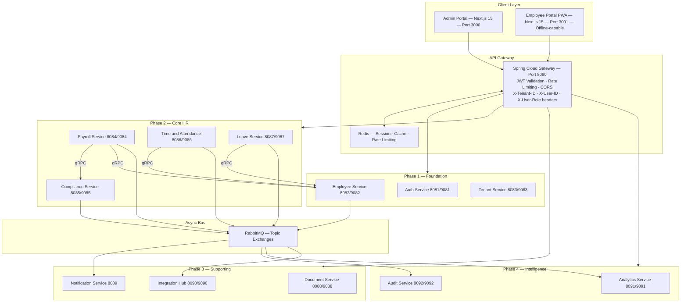
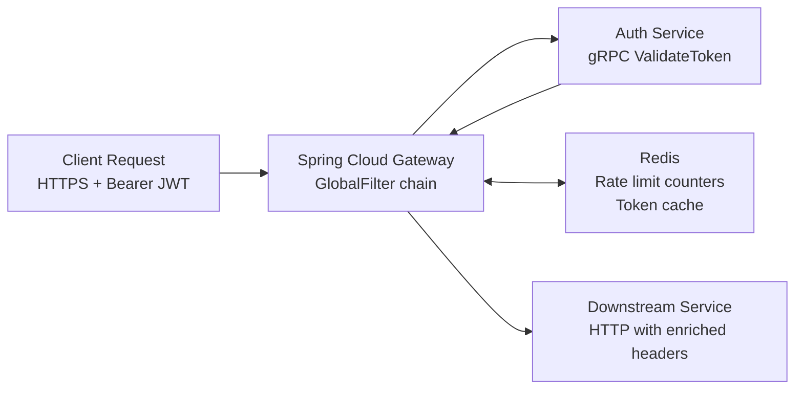
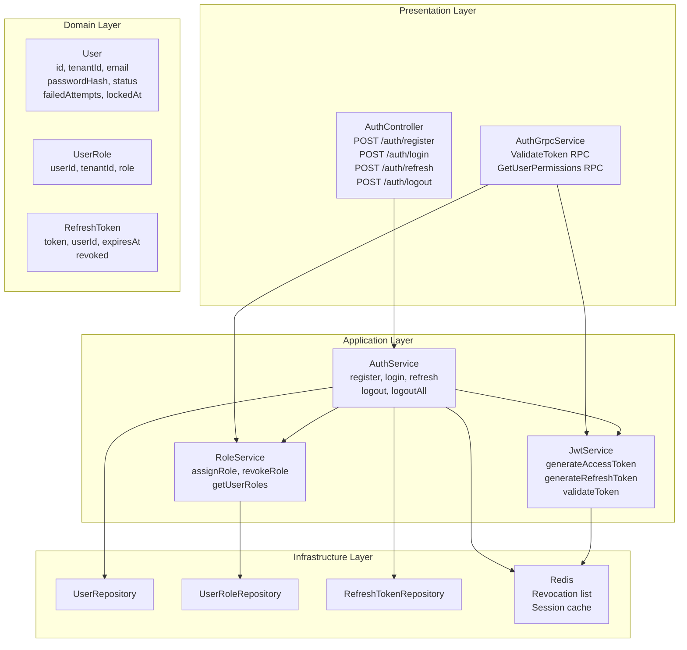
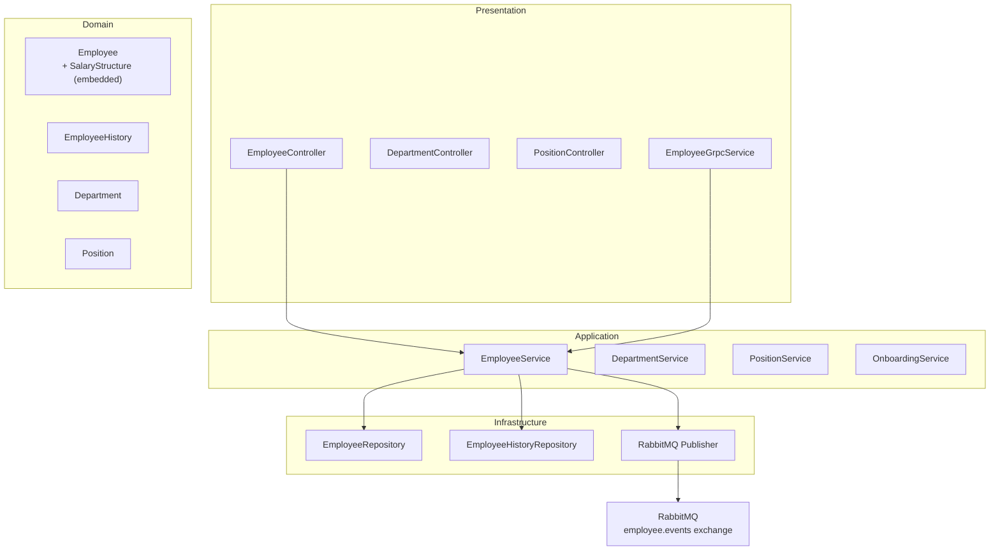
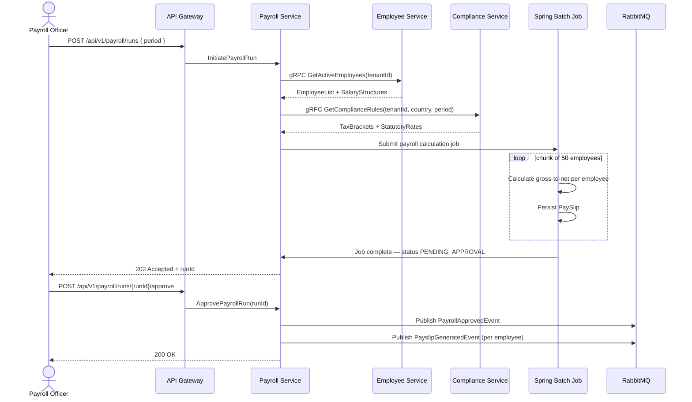
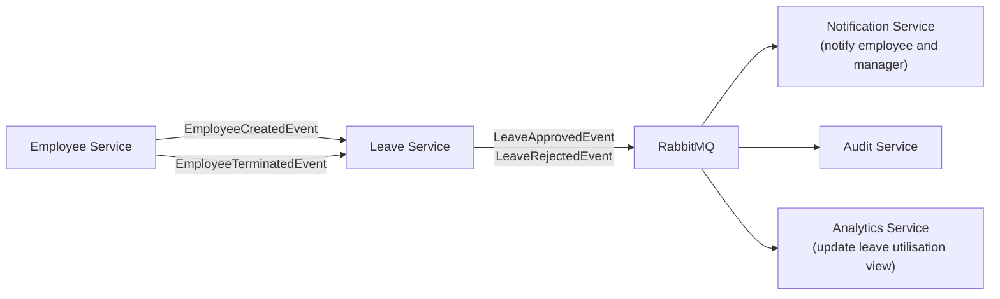
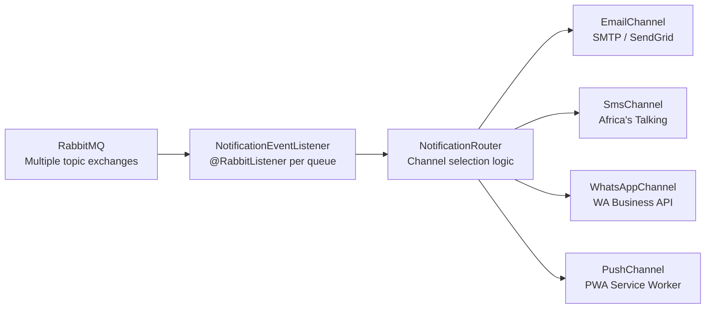

# AndikishaHR — Engineering Reference Documentation

**Version:** 1.0  
**Status:** Living Document  
**Audience:** Software Engineers (mid-to-senior level)  
**Stack:** Java 21 LTS · Spring Boot 3.4 · Spring Cloud 2024.0 · Gradle Kotlin DSL · PostgreSQL 16 · gRPC · RabbitMQ · Redis · Docker · Kubernetes  
**Last Updated:** April 2026

---

> **Stack Note:** Earlier planning documents and prompt templates may reference NestJS and TypeScript. That was a discarded iteration. The production stack is Java 21 with Spring Boot 3.4. All documentation here reflects the current, correct codebase.

---

## Table of Contents

1. [System Overview](#1-system-overview)
2. [Shared Libraries](#2-shared-libraries)
3. [API Gateway](#3-api-gateway)
4. [Auth Service](#4-auth-service)
5. [Tenant Service](#5-tenant-service)
6. [Employee Service](#6-employee-service)
7. [Payroll Service](#7-payroll-service)
8. [Compliance Service](#8-compliance-service)
9. [Leave Service](#9-leave-service)
10. [Time and Attendance Service](#10-time-and-attendance-service)
11. [Document Service](#11-document-service)
12. [Notification Service](#12-notification-service)
13. [Integration Hub Service](#13-integration-hub-service)
14. [Analytics Service](#14-analytics-service)
15. [Audit Service](#15-audit-service)
16. [Cross-Cutting Concerns](#16-cross-cutting-concerns)
17. [Local Development Setup](#17-local-development-setup)
18. [Coding Standards Reference](#18-coding-standards-reference)

---

## 1. System Overview

AndikishaHR is an enterprise HR and payroll SaaS platform built for Kenyan and East African SMEs. The platform automates Kenya's full statutory compliance stack — PAYE, NSSF, SHIF, Housing Levy, NITA, and HELB — manages the complete employee lifecycle, and distributes payslips to employees on their phones via an offline-capable PWA.

The backend is 13 microservices deployed on Kubernetes, built on Java 21 and Spring Boot 3.4. Services communicate synchronously via gRPC and asynchronously via RabbitMQ topic exchanges. Every service owns its own PostgreSQL 16 database with schema-per-tenant isolation. Redis handles caching, rate limiting, and session state at the gateway layer.

### Service Map

| Service | Phase | HTTP Port | gRPC Port | Database |
|---|---|---|---|---|
| api-gateway | 1 | 8080 | — | — |
| auth-service | 1 | 8081 | 9081 | andikisha_auth |
| employee-service | 1 | 8082 | 9082 | andikisha_employee |
| tenant-service | 1 | 8083 | 9083 | andikisha_tenant |
| payroll-service | 2 | 8084 | 9084 | andikisha_payroll |
| compliance-service | 2 | 8085 | 9085 | andikisha_compliance |
| time-attendance-service | 2 | 8086 | 9086 | andikisha_time |
| leave-service | 2 | 8087 | 9087 | andikisha_leave |
| document-service | 3 | 8088 | 9088 | andikisha_document |
| notification-service | 3 | 8089 | 9089 | — |
| integration-hub-service | 3 | 8090 | 9090 | andikisha_integration |
| analytics-service | 4 | 8091 | 9091 | andikisha_analytics |
| audit-service | 4 | 8092 | 9092 | andikisha_audit |

### High-Level Architecture



### Standard Per-Service DDD Package Structure

Every domain service — without exception — follows this four-layer layout. Do not add layers or flatten the structure.

```
com.andikisha.{service}/
  domain/
    model/          -- JPA entities, value objects, enums, aggregates
    repository/     -- Spring Data JPA interfaces
    exception/      -- Domain-specific exceptions
  application/
    service/        -- Business logic and use case orchestration
    dto/
      request/      -- Inbound DTOs with Jakarta Bean Validation
      response/     -- Outbound DTOs (Java records)
    mapper/         -- MapStruct mappers
    port/           -- Interfaces for infrastructure (publishers, external clients)
  infrastructure/
    messaging/      -- RabbitMQ publishers and listeners
    grpc/           -- gRPC server and client implementations
    config/         -- Spring @Configuration classes
    persistence/    -- Multi-tenant datasource routing
  presentation/
    controller/     -- @RestController classes
    advice/         -- @RestControllerAdvice exception handlers
    filter/         -- Servlet filters (tenant context, request logging)
```

### RBAC Roles

Seven roles are defined as constants in the auth-service. All role-based decisions across the platform reference these exact strings.

| Role | Scope | Typical User |
|---|---|---|
| SUPER_ADMIN | Platform-wide | AndikishaHR internal operations only |
| ADMIN | Tenant-wide | Business owner, designated IT admin |
| HR_MANAGER | Tenant-wide | Senior HR, can process and approve payroll |
| PAYROLL_OFFICER | Payroll domain | Can process but not unilaterally approve payroll |
| HR | Tenant-wide | HR officer, employee records, no payroll access |
| LINE_MANAGER | Department-scoped | Approves leave and timesheets for direct reports |
| EMPLOYEE | Own records only | Self-service access via employee portal |

---

## 2. Shared Libraries

Three Gradle modules serve as the foundation for all services. Every service imports one or more of these. They contain no business logic — only cross-cutting infrastructure.

### 2.1 andikisha-common

**Purpose:** Shared domain primitives and utilities that every service needs.

**Key components:**

`BaseEntity` — Abstract JPA entity that all service entities extend. Provides:
- `id` — UUID, generated via `@GeneratedValue(strategy = GenerationType.UUID)`
- `tenantId` — String, non-nullable, indexed. Every query must filter by this.
- `createdAt`, `updatedAt` — Populated by `@PrePersist` / `@PreUpdate`
- `createdBy` — Populated from `TenantContext`
- `version` — Optimistic locking via `@Version`

`Money` — Value object for all monetary amounts. Wraps `BigDecimal` with a `Currency`. Provides arithmetic methods (`add`, `subtract`, `multiply`) that return new `Money` instances. Never use `double` or `float` for money in this codebase.

`TenantContext` — Thread-local holder for the current tenant identifier. Set by the `TenantContextFilter` in the presentation layer on every inbound request. Cleared after request completion. Used by `BaseEntity.createdBy` and the multi-tenant datasource router.

`ErrorResponse` — Standard error envelope used by all `@RestControllerAdvice` handlers. Fields: `timestamp`, `status`, `error`, `message`, `path`, `traceId`.

Common exception base classes: `AndikishaException`, `ResourceNotFoundException`, `ValidationException`, `TenantNotFoundException`, `UnauthorizedException`.

Jakarta Bean Validation custom validators: `@KenyaPhoneNumber`, `@KraPinFormat`, `@NationalIdFormat`.

### 2.2 andikisha-proto

**Purpose:** Single source of truth for all gRPC contracts across the platform.

Contains seven `.proto` files defining the service contracts used for synchronous inter-service communication:

| Proto File | Service Contract |
|---|---|
| auth.proto | Token validation, permission checks |
| employee.proto | Employee lookup, salary queries |
| tenant.proto | Tenant resolution, plan checks |
| payroll.proto | Payroll run queries, payslip access |
| leave.proto | Leave balance queries |
| compliance.proto | Tax rules, statutory rates |
| attendance.proto | Attendance records, overtime data |

All services that expose a gRPC endpoint implement the generated `*ImplBase` class. All services that call another service via gRPC use the generated stub, injected as a Spring bean.

### 2.3 andikisha-events

**Purpose:** Typed RabbitMQ domain event classes shared across publisher and consumer services.

All event classes extend `BaseEvent`, which carries:
- `eventId` — UUID
- `eventType` — String (class name)
- `tenantId` — String
- `occurredAt` — Instant
- `version` — int (for event schema evolution)

`@JsonTypeInfo` is applied on `BaseEvent` for correct polymorphic deserialization by RabbitMQ consumers. Without this, consumers receiving a `BaseEvent` reference cannot reconstruct the correct subtype.

**Defined events (15 total):**

Employee domain: `EmployeeCreatedEvent`, `EmployeeUpdatedEvent`, `EmployeeTerminatedEvent`, `SalaryChangedEvent`

Payroll domain: `PayrollRunInitiatedEvent`, `PayrollApprovedEvent`, `PayslipGeneratedEvent`, `PayrollReversedEvent`

Leave domain: `LeaveRequestedEvent`, `LeaveApprovedEvent`, `LeaveRejectedEvent`, `LeaveCancelledEvent`

Attendance domain: `AttendanceRecordedEvent`, `TimesheetApprovedEvent`

Compliance domain: `StatutoryRateUpdatedEvent`

---

## 3. API Gateway

### 3.1 Service Overview

**Port:** 8080  
**Technology:** Spring Cloud Gateway (reactive, built on Spring WebFlux)

The API Gateway is the single entry point for all external traffic. It terminates TLS (via NGINX ingress in production), validates JWT tokens, enforces rate limits, applies CORS policy, and routes requests to the appropriate downstream service. It does not contain any business logic.

The gateway is built after Phase 1 and 2 services are stable. During active backend development, services are called directly by port.

### 3.2 Responsibilities

The gateway performs four functions on every inbound request:

JWT validation happens first. The gateway calls the Auth Service via gRPC (`ValidateToken`) with the bearer token extracted from the `Authorization` header. If the token is invalid or expired, the gateway returns 401 immediately and does not forward the request.

Header enrichment happens after successful validation. The gateway extracts `tenantId`, `userId`, and `role` from the validated token claims and forwards them as `X-Tenant-ID`, `X-User-ID`, and `X-User-Role` headers. Downstream services trust these headers without re-validating the JWT.

Rate limiting uses Redis to track request counts per `tenantId` and per `userId`. Limits are configurable per tenant plan. When a limit is exceeded, the gateway returns 429 with a `Retry-After` header.

Routing maps URL path prefixes to downstream services:

| Path Prefix | Downstream Service |
|---|---|
| /api/v1/auth/** | auth-service:8081 |
| /api/v1/employees/** | employee-service:8082 |
| /api/v1/tenants/** | tenant-service:8083 |
| /api/v1/payroll/** | payroll-service:8084 |
| /api/v1/compliance/** | compliance-service:8085 |
| /api/v1/attendance/** | time-attendance-service:8086 |
| /api/v1/leave/** | leave-service:8087 |
| /api/v1/documents/** | document-service:8088 |
| /api/v1/notifications/** | notification-service:8089 |
| /api/v1/integrations/** | integration-hub-service:8090 |
| /api/v1/analytics/** | analytics-service:8091 |
| /api/v1/audit/** | audit-service:8092 |

### 3.3 Architecture



### 3.4 Security

The gateway runs mutual TLS in production between itself and downstream services. JWT public keys are cached in Redis after first fetch from the auth service (TTL 5 minutes) to avoid a gRPC call on every request.

CORS policy allows only the `admin-portal` and `employee-portal` origins. All other origins are rejected at the gateway before any downstream call is made.

### 3.5 Scaling

The gateway runs a minimum of two replicas in Kubernetes with HPA configured to scale to five replicas at 70% CPU. Because it is stateless (all session data in Redis), horizontal scaling requires no coordination between replicas.

---

## 4. Auth Service

### 4.1 Service Overview

**Ports:** HTTP 8081 / gRPC 9081  
**Database:** andikisha_auth  
**Phase:** 1 — Foundation

The Auth Service owns the complete identity and access management domain. It issues JWT access and refresh tokens, manages user accounts, enforces RBAC, handles account locking, and exposes a gRPC `ValidateToken` endpoint that the API Gateway calls on every inbound request.

### 4.2 Core Functionality

**Authentication** — Users register with email, password, and tenant context. Passwords are hashed with BCrypt (cost factor 12). On login, the service issues a short-lived access token (15 minutes) and a long-lived refresh token (7 days). Refresh token rotation is enforced: each use of a refresh token issues a new refresh token and invalidates the old one.

**Account locking** — Five consecutive failed login attempts locks the account. A locked account can be unlocked by an ADMIN or HR_MANAGER via the API, or automatically after a configurable cooldown period.

**RBAC** — Roles are stored per user per tenant in a `user_roles` table. A user can hold multiple roles within a tenant. The seven canonical roles are `SUPER_ADMIN`, `ADMIN`, `HR_MANAGER`, `PAYROLL_OFFICER`, `HR`, `LINE_MANAGER`, and `EMPLOYEE`.

**gRPC token validation** — The `ValidateToken` RPC is called by the API Gateway. It validates the signature, checks expiry, verifies the token is not in the revocation list (Redis), and returns `TokenValid`, `tenantId`, `userId`, and a list of roles. This is designed to be fast — 95th percentile target under 5ms.

**Session management** — Active sessions are tracked in Redis. Logout invalidates the specific access token by adding it to the Redis revocation list. `LogoutAll` invalidates all active sessions for the user across all devices.

### 4.3 Architecture



### 4.4 Key Entities

**User**
```
id             UUID PK
tenant_id      VARCHAR NOT NULL (indexed)
email          VARCHAR UNIQUE per tenant
password_hash  VARCHAR NOT NULL
status         ENUM (ACTIVE, LOCKED, SUSPENDED, PENDING_VERIFICATION)
failed_attempts INT DEFAULT 0
locked_at      TIMESTAMP NULL
last_login_at  TIMESTAMP NULL
created_at     TIMESTAMP
updated_at     TIMESTAMP
version        INT (optimistic lock)
```

**UserRole**
```
id         UUID PK
user_id    UUID FK (no DB foreign key, UUID reference)
tenant_id  VARCHAR NOT NULL
role       ENUM (SUPER_ADMIN, ADMIN, HR_MANAGER, PAYROLL_OFFICER, HR, LINE_MANAGER, EMPLOYEE)
```

**RefreshToken**
```
id          UUID PK
user_id     UUID
tenant_id   VARCHAR
token_hash  VARCHAR UNIQUE
expires_at  TIMESTAMP
revoked     BOOLEAN DEFAULT FALSE
revoked_at  TIMESTAMP NULL
```

### 4.5 API Contracts

```
POST /api/v1/auth/register
Body: { tenantId, email, password, firstName, lastName }
Response 201: { userId, email, tenantId }

POST /api/v1/auth/login
Body: { email, password, tenantId }
Response 200: { accessToken, refreshToken, expiresIn, tokenType: "Bearer" }

POST /api/v1/auth/refresh
Body: { refreshToken }
Response 200: { accessToken, refreshToken, expiresIn }

POST /api/v1/auth/logout
Header: Authorization: Bearer {token}
Response 204

POST /api/v1/auth/logout-all
Header: Authorization: Bearer {token}
Response 204

GET /api/v1/auth/me
Header: Authorization: Bearer {token}
Response 200: { userId, email, tenantId, roles }
```

**gRPC contract (auth.proto)**
```protobuf
service AuthService {
  rpc ValidateToken(ValidateTokenRequest) returns (ValidateTokenResponse);
  rpc GetUserPermissions(GetPermissionsRequest) returns (GetPermissionsResponse);
}

message ValidateTokenRequest { string token = 1; }
message ValidateTokenResponse {
  bool valid = 1;
  string user_id = 2;
  string tenant_id = 3;
  repeated string roles = 4;
  string error = 5;
}
```

### 4.6 Security Considerations

JWT access tokens are signed with RS256 (asymmetric). The private key lives in Kubernetes Secrets and is loaded at startup. The public key is distributed to the API Gateway for local verification (cached in Redis).

Passwords must be at least 8 characters and pass a complexity check (uppercase, lowercase, digit, special character). The service never returns password hashes in any response or log.

All token operations are logged to the Audit Service via RabbitMQ.

### 4.7 Error Handling

| Scenario | HTTP Status | Error Code |
|---|---|---|
| Invalid credentials | 401 | AUTH_001 |
| Account locked | 423 | AUTH_002 |
| Token expired | 401 | AUTH_003 |
| Token invalid/tampered | 401 | AUTH_004 |
| Refresh token revoked | 401 | AUTH_005 |
| Tenant not found | 404 | AUTH_006 |

---

## 5. Tenant Service

### 5.1 Service Overview

**Ports:** HTTP 8083 / gRPC 9083  
**Database:** andikisha_tenant  
**Phase:** 1 — Foundation

The Tenant Service owns the provisioning and configuration of organisations (tenants) on the platform. When a new company signs up, the Tenant Service creates the tenant record, provisions the PostgreSQL schema in each downstream service database, assigns a billing plan, and publishes a `TenantCreatedEvent` that triggers initialization in dependent services.

### 5.2 Core Functionality

**Tenant registration** — Creates the tenant record with a unique slug, assigns a country code (default `KE`), and sets the active plan. The slug is URL-safe and used in subdomain routing (`{slug}.andikisha.io`).

**Schema provisioning** — After tenant creation, the service calls each downstream service's gRPC `ProvisionSchema` endpoint (or publishes the `TenantCreatedEvent` which downstream services use to create their own schema). Schema names follow the pattern `tenant_{slug}`.

**Plan management** — Plans are `STARTER`, `GROWTH`, and `ENTERPRISE`. Each plan has a feature flag set stored in `tenant_feature_flags`. The API Gateway reads plan-level feature flags via gRPC to enforce plan limits at the edge.

**Feature flags** — Per-tenant toggles for modules (e.g., `biometric_attendance`, `whatsapp_notifications`, `multi_currency`). Controlled by ADMIN users and by the platform team for SUPER_ADMIN-level toggles.

### 5.3 Key Events Published

`TenantCreatedEvent` — Published to the `tenant.events` exchange when a new tenant is provisioned. Consumed by: Leave Service (create default leave policies), Compliance Service (initialize rate tables for the tenant's country), Notification Service (register notification preferences).

### 5.4 API Contracts

```
POST /api/v1/tenants
Body: { name, slug, ownerEmail, ownerName, countryCode, plan }
Response 201: { tenantId, slug, name, plan, status }
Roles: SUPER_ADMIN

GET /api/v1/tenants/{tenantId}
Response 200: { tenantId, slug, name, plan, countryCode, active, createdAt }
Roles: SUPER_ADMIN, ADMIN (own tenant only)

PATCH /api/v1/tenants/{tenantId}
Body: { name, address, phone, logoUrl }
Response 200: TenantResponse
Roles: ADMIN

GET /api/v1/tenants/{tenantId}/feature-flags
Response 200: { flags: { key: boolean } }
Roles: ADMIN, HR_MANAGER

PUT /api/v1/tenants/{tenantId}/feature-flags/{flag}
Body: { enabled: boolean }
Response 200
Roles: SUPER_ADMIN, ADMIN
```

### 5.5 Data Model

**Tenant**
```
id            UUID PK
slug          VARCHAR UNIQUE
name          VARCHAR
country_code  CHAR(2) DEFAULT 'KE'
plan          ENUM (STARTER, GROWTH, ENTERPRISE)
schema_name   VARCHAR UNIQUE
active        BOOLEAN DEFAULT TRUE
created_at    TIMESTAMP
updated_at    TIMESTAMP
```

**TenantFeatureFlag**
```
id         UUID PK
tenant_id  UUID
flag_key   VARCHAR
enabled    BOOLEAN
updated_by VARCHAR
updated_at TIMESTAMP
```

---

## 6. Employee Service

### 6.1 Service Overview

**Ports:** HTTP 8082 / gRPC 9082  
**Database:** andikisha_employee  
**Phase:** 1 — Foundation

The Employee Service is the source of truth for every person connected to a tenant — permanent staff, casual workers, contractors, interns, and directors. Every other service references employee records as UUID pointers. No service stores a copy of employee data; they call the Employee Service when they need it.

### 6.2 Core Functionality

**Employee lifecycle management** — Create, read, update, and archive employee records. Employees are never deleted; they are archived on exit to preserve audit trails. Status transitions are: `ACTIVE` → `ON_LEAVE`, `SUSPENDED`, `EXITED`.

**Salary structure** — The `SalaryStructure` is an embeddable value object on the Employee entity. It holds base salary, allowances (housing, transport, medical), and grade. Payroll reads salary data via gRPC.

**Organisational structure** — Departments, positions, and reporting lines. An employee belongs to one department and holds one position. Reporting line is a self-reference on Employee (`reportsToId`).

**Employment history** — Every change to employment terms (salary, position, department, status) is written to `employee_history` as an immutable audit record. This is the source of truth for KRA and audit queries.

**Onboarding and offboarding workflows** — Checklist-driven processes. Onboarding includes document collection, system access provisioning, and equipment assignment. Offboarding calculates terminal benefits, generates a certificate of service, and triggers access revocation.

### 6.3 Events Published

| Event | Trigger | Consumers |
|---|---|---|
| EmployeeCreatedEvent | New employee saved and activated | Leave (init balances), Payroll (enroll), Notification (welcome) |
| EmployeeTerminatedEvent | Employee status set to EXITED | Leave (freeze accruals), Payroll (final run), Notification |
| SalaryChangedEvent | Salary structure updated | Payroll (recalculate), Audit |
| EmployeeUpdatedEvent | Profile update | Audit, Analytics |

### 6.4 Architecture



### 6.5 Key Entities

**Employee**
```
id                UUID PK
tenant_id         VARCHAR NOT NULL
employee_number   VARCHAR (auto-generated, tenant-scoped)
first_name        VARCHAR
last_name         VARCHAR
email             VARCHAR
phone             VARCHAR
national_id       VARCHAR
kra_pin           VARCHAR
department_id     UUID
position_id       UUID
reports_to_id     UUID (self-reference)
employment_type   ENUM (PERMANENT, CONTRACT, CASUAL, DIRECTOR, INTERN)
start_date        DATE
probation_end     DATE
contract_end      DATE NULL
status            ENUM (ACTIVE, ON_LEAVE, SUSPENDED, EXITED)
exited_at         TIMESTAMP NULL
-- SalaryStructure (embedded)
base_salary       DECIMAL(15,2)
housing_allowance DECIMAL(15,2)
transport_allowance DECIMAL(15,2)
medical_allowance  DECIMAL(15,2)
currency          CHAR(3) DEFAULT 'KES'
grade             VARCHAR
effective_date    DATE
```

**EmployeeHistory**
```
id            UUID PK
tenant_id     VARCHAR
employee_id   UUID
change_type   ENUM (SALARY, POSITION, DEPARTMENT, STATUS, ONBOARDED, EXITED)
old_value     JSONB
new_value     JSONB
changed_by    VARCHAR
changed_at    TIMESTAMP
```

### 6.6 API Contracts

```
POST /api/v1/employees
Body: CreateEmployeeRequest
Response 201: EmployeeResponse
Roles: HR_MANAGER, HR, ADMIN

GET /api/v1/employees
Query: page, size, departmentId, status, employmentType
Response 200: Page<EmployeeResponse>
Roles: HR_MANAGER, HR, PAYROLL_OFFICER, ADMIN

GET /api/v1/employees/{id}
Response 200: EmployeeResponse
Roles: HR_MANAGER, HR, PAYROLL_OFFICER, ADMIN (all); LINE_MANAGER (own dept); EMPLOYEE (own)

PATCH /api/v1/employees/{id}
Body: UpdateEmployeeRequest
Response 200: EmployeeResponse
Roles: HR_MANAGER, HR, ADMIN

POST /api/v1/employees/{id}/terminate
Body: { terminationDate, reason, terminalBenefitsNote }
Response 200: EmployeeResponse
Roles: HR_MANAGER, ADMIN

GET /api/v1/employees/{id}/history
Response 200: List<EmployeeHistoryResponse>
Roles: HR_MANAGER, ADMIN

GET /api/v1/departments
GET /api/v1/departments/{id}
POST /api/v1/departments
DELETE /api/v1/departments/{id}
Roles: HR_MANAGER, ADMIN

GET /api/v1/positions
POST /api/v1/positions
Roles: HR_MANAGER, ADMIN
```

**gRPC contract (employee.proto)**
```protobuf
service EmployeeService {
  rpc GetActiveEmployees(GetActiveEmployeesRequest) returns (EmployeeListResponse);
  rpc GetEmployeeSalary(GetSalaryRequest) returns (SalaryResponse);
  rpc GetEmployeeById(GetEmployeeRequest) returns (EmployeeResponse);
  rpc ValidateEmployeeExists(ValidateRequest) returns (ValidateResponse);
}
```

### 6.7 Security

All queries at the repository level include `WHERE tenant_id = ?`. Cross-tenant access is structurally impossible at the query layer. LINE_MANAGER scope is enforced in the application service layer by checking that the requested employee's `departmentId` matches the requesting user's department.

---

## 7. Payroll Service

### 7.1 Service Overview

**Ports:** HTTP 8084 / gRPC 9084  
**Database:** andikisha_payroll  
**Phase:** 2 — Core HR

The Payroll Service is the most computationally significant service in the platform. It owns the full payroll run lifecycle from initiation through gross-to-net calculation, payslip generation, approval, and payment file creation. It delegates statutory tax rules entirely to the Compliance Service via gRPC — it never calculates statutory deductions independently.

### 7.2 Core Functionality

**Payroll run state machine** — A `PayrollRun` moves through states: `DRAFT` → `CALCULATING` → `PENDING_APPROVAL` → `APPROVED` → `DISBURSING` → `COMPLETED` or `REVERSED`. Once `APPROVED`, a run cannot be modified without a reversal.

**Gross-to-net calculation** — For each active employee, the service:
1. Fetches salary structure via gRPC from Employee Service
2. Fetches current statutory rates via gRPC from Compliance Service
3. Applies gross earnings components (base, allowances, overtime from Attendance Service)
4. Applies statutory deductions in order: PAYE, NSSF, SHIF, Housing Levy, NITA, HELB
5. Applies custom deductions (salary advance repayments, private pension)
6. Derives net pay and writes a `PaySlip` record

**Spring Batch job** — The calculation loop runs as a Spring Batch job with chunk-based processing (chunk size 50). This makes large payroll runs (1,000+ employees) restartable on failure without reprocessing already-completed employees.

**Payroll approval workflow** — Calculated runs require two-role approval: `PAYROLL_OFFICER` processes, then `HR_MANAGER` or `ADMIN` approves. A single user cannot both process and approve.

**Payment file generation** — After approval, the service generates M-Pesa B2C batch payment files and bank EFT files. These are passed to the Integration Hub for disbursement.

**Payroll reversal** — A `COMPLETED` payroll run can be reversed. The reversal creates mirror negative payslips, records the reversal reason, and notifies downstream consumers via `PayrollReversedEvent`.

### 7.3 Kenya Statutory Deduction Logic

The Payroll Service receives statutory rules from Compliance Service and applies them in this sequence:

**PAYE (Pay As You Earn)**
Progressive monthly brackets (rates current as of Finance Act 2024):
- KES 0 – 24,000 at 10%
- KES 24,001 – 32,333 at 25%
- KES 32,334 – 500,000 at 30%
- KES 500,001 – 800,000 at 32.5%
- Above KES 800,000 at 35%
Less: Personal Relief KES 2,400/month and SHIF insurance relief (15% of SHIF, max KES 5,000/month).

**NSSF**
Tier I: 6% of pensionable pay up to KES 8,000 lower earnings limit.
Tier II: 6% on the band between KES 8,000 and the upper earnings limit (KES 72,000).
Both employer and employee contributions calculated. Employers with approved alternative pension schemes can opt out of Tier II via a tenant-level flag.

**SHIF (Social Health Insurance Fund)**
2.75% of gross salary, uncapped. Minimum KES 300/month. SHIF replaced NHIF in October 2024. The deduction is tax-deductible; SHIF relief applied in PAYE calculation.

**Housing Levy**
1.5% employee contribution + 1.5% employer contribution. Fully deductible from December 2024. Remitted monthly to KRA.

**NITA**
0.5% of gross salary, employer contribution only.

**HELB**
Per-employee fixed monthly deduction based on the loan agreement stored on the employee record.

### 7.4 Data Model

**PayrollRun**
```
id                UUID PK
tenant_id         VARCHAR
period_year       INT
period_month      INT
pay_frequency     ENUM (MONTHLY, BI_WEEKLY, WEEKLY, DAILY)
status            ENUM (DRAFT, CALCULATING, PENDING_APPROVAL, APPROVED, DISBURSING, COMPLETED, REVERSED)
total_gross       DECIMAL(15,2)
total_net         DECIMAL(15,2)
total_paye        DECIMAL(15,2)
total_nssf_emp    DECIMAL(15,2)
total_nssf_er     DECIMAL(15,2)
total_shif        DECIMAL(15,2)
total_housing     DECIMAL(15,2)
employee_count    INT
processed_by      VARCHAR
approved_by       VARCHAR
processed_at      TIMESTAMP
approved_at       TIMESTAMP
```

**PaySlip**
```
id                  UUID PK
tenant_id           VARCHAR
payroll_run_id      UUID
employee_id         UUID
period_year         INT
period_month        INT
gross_pay           DECIMAL(15,2)
basic_salary        DECIMAL(15,2)
housing_allowance   DECIMAL(15,2)
transport_allowance DECIMAL(15,2)
other_allowances    JSONB
paye                DECIMAL(15,2)
nssf_employee       DECIMAL(15,2)
nssf_employer       DECIMAL(15,2)
shif                DECIMAL(15,2)
housing_levy_emp    DECIMAL(15,2)
housing_levy_er     DECIMAL(15,2)
nita                DECIMAL(15,2)
helb                DECIMAL(15,2)
custom_deductions   JSONB
net_pay             DECIMAL(15,2)
status              ENUM (GENERATED, DISTRIBUTED)
```

### 7.5 Payroll Processing Sequence



### 7.6 API Contracts

```
POST /api/v1/payroll/runs
Body: { periodYear, periodMonth, payFrequency }
Response 202: { runId, status: "CALCULATING" }
Roles: PAYROLL_OFFICER, HR_MANAGER, ADMIN

GET /api/v1/payroll/runs
Query: year, month, status
Response 200: Page<PayrollRunSummary>
Roles: PAYROLL_OFFICER, HR_MANAGER, ADMIN

GET /api/v1/payroll/runs/{runId}
Response 200: PayrollRunResponse (with payslip summaries)
Roles: PAYROLL_OFFICER, HR_MANAGER, ADMIN

POST /api/v1/payroll/runs/{runId}/approve
Response 200: PayrollRunResponse
Roles: HR_MANAGER, ADMIN (not PAYROLL_OFFICER)

POST /api/v1/payroll/runs/{runId}/reverse
Body: { reason }
Response 200
Roles: ADMIN

GET /api/v1/payroll/payslips/{employeeId}
Query: year, month
Response 200: List<PayslipResponse>
Roles: PAYROLL_OFFICER, HR_MANAGER, ADMIN; EMPLOYEE (own only)

GET /api/v1/payroll/payslips/{id}/pdf
Response 200: application/pdf
Roles: HR_MANAGER, ADMIN, EMPLOYEE (own)
```

### 7.7 Error Handling

| Scenario | HTTP Status | Error Code |
|---|---|---|
| Duplicate payroll run for period | 409 | PAY_001 |
| Run not in correct state for action | 422 | PAY_002 |
| Compliance Service gRPC unavailable | 503 | PAY_003 |
| Employee Service gRPC unavailable | 503 | PAY_004 |
| Approval by same user who processed | 403 | PAY_005 |

---

## 8. Compliance Service

### 8.1 Service Overview

**Ports:** HTTP 8085 / gRPC 9085  
**Database:** andikisha_compliance  
**Phase:** 2 — Core HR

The Compliance Service is the statutory rules engine. It is intentionally decoupled from the Payroll Service so that regulatory changes — new PAYE brackets after a Finance Bill, adjusted NSSF limits, updated Housing Levy rates — can be updated, versioned, tested, and deployed without touching payroll processing code.

No other service calculates statutory deductions. This is a hard architectural rule.

### 8.2 Core Functionality

**Rate table management** — Statutory rates are stored as versioned records with effective dates. When the Finance Bill passes, the compliance team adds new rate records with the applicable effective date. The Payroll Service always queries rates for the pay period date, so historical payroll recalculations automatically apply the rates that were correct at that time.

**Country pack configuration** — Rate tables are keyed by `countryCode`. Kenya is the default. Rwanda and Ethiopia packs are planned for Phase 3.

**Compliance calendar** — Filing deadlines for each statutory obligation are stored per tenant with a status tracker (`PENDING`, `FILED`, `OVERDUE`, `ACKNOWLEDGED`). The service publishes proactive alerts 7, 3, and 1 day before each deadline.

**Filing report generation** — After payroll approval, the service can generate KRA P10 format files, NSSF remittance reports, SHIF remittance reports, and Housing Levy schedules ready for submission or upload.

**Employment Act validations** — The service exposes validation RPCs for: minimum wage compliance (`KES 15,201/month` as of 2024), correct overtime rates (1.5x weekday, 2.0x weekend/public holiday), and correct leave entitlements.

### 8.3 Key Entities

**StatutoryRateTable**
```
id             UUID PK
country_code   CHAR(2)
rate_type      ENUM (PAYE, NSSF, SHIF, HOUSING_LEVY, NITA, HELB_BASE)
effective_from DATE
effective_to   DATE NULL
rate_data      JSONB (brackets or flat rates)
is_active      BOOLEAN
created_by     VARCHAR
```

**ComplianceDeadline**
```
id              UUID PK
tenant_id       VARCHAR
obligation_type ENUM (PAYE, NSSF, SHIF, HOUSING_LEVY, NITA)
period_year     INT
period_month    INT
due_date        DATE
status          ENUM (PENDING, FILED, OVERDUE, ACKNOWLEDGED)
filed_at        TIMESTAMP NULL
reference_no    VARCHAR NULL
```

### 8.4 gRPC Contract (compliance.proto)

```protobuf
service ComplianceService {
  rpc GetComplianceRules(GetRulesRequest) returns (ComplianceRulesResponse);
  rpc ValidateMinimumWage(WageValidationRequest) returns (ValidationResponse);
  rpc GetFilingDeadlines(DeadlinesRequest) returns (DeadlinesResponse);
  rpc UpdateRateTable(UpdateRateRequest) returns (UpdateRateResponse);
}

message GetRulesRequest {
  string tenant_id = 1;
  string country_code = 2;
  string period_date = 3;  // ISO date — rates are selected by effective_from <= date
}

message ComplianceRulesResponse {
  repeated PayeBracket paye_brackets = 1;
  NssfRules nssf = 2;
  ShifRules shif = 3;
  HousingLevyRules housing_levy = 4;
  float nita_rate = 5;
  float personal_relief = 6;
}
```

### 8.5 Events Published

`StatutoryRateUpdatedEvent` — Published when a new rate table is activated. Consumed by the Notification Service (alert compliance admins) and the Audit Service.

---

## 9. Leave Service

### 9.1 Service Overview

**Ports:** HTTP 8087 / gRPC 9087  
**Database:** andikisha_leave  
**Phase:** 2 — Core HR

The Leave Service manages Kenya Employment Act-compliant leave across the full lifecycle — policy configuration, balance tracking, request submission, multi-level approval, and integration with payroll for unpaid leave deductions.

### 9.2 Core Functionality

**Leave types** — Seven types are supported: `ANNUAL`, `SICK`, `MATERNITY`, `PATERNITY`, `COMPASSIONATE`, `UNPAID`, `STUDY`. New types can be added via `LeavePolicy` configuration.

**Leave policies** — Each tenant configures `LeavePolicy` records (one per leave type per tenant). Policies define entitlement days, carry-over limits, notice requirements, medical certificate requirements, and max consecutive days.

**Balance initialization** — When `EmployeeCreatedEvent` is consumed, the service creates a `LeaveBalance` record for each active `LeavePolicy` in the tenant. If the employee starts mid-year, annual leave is pro-rated by months remaining.

**Termination handling** — `EmployeeTerminatedEvent` triggers a balance freeze. No further accruals occur. Outstanding balance is calculated for the final pay calculation (payroll reads leave balance via gRPC).

**Approval workflow** — Leave requests go through: `PENDING` (submitted) → `APPROVED` or `REJECTED`. The approver is the employee's line manager or HR. The service checks team calendar for conflicts before allowing approval.

### 9.3 Domain Model

**LeavePolicy**
```
id                   UUID PK
tenant_id            VARCHAR
leave_type           ENUM (ANNUAL, SICK, MATERNITY, PATERNITY, COMPASSIONATE, UNPAID, STUDY)
days_per_year        INT
carry_over_max       INT
requires_approval    BOOLEAN DEFAULT TRUE
requires_medical_cert BOOLEAN DEFAULT FALSE
min_days_notice      INT DEFAULT 0
max_consecutive_days INT NULL
is_active            BOOLEAN DEFAULT TRUE
```

**LeaveBalance**
```
id              UUID PK
tenant_id       VARCHAR
employee_id     UUID
leave_type      ENUM
year            INT
total_days      DECIMAL(5,2)
used_days       DECIMAL(5,2)
pending_days    DECIMAL(5,2)
carried_over    DECIMAL(5,2)
```

**LeaveRequest**
```
id             UUID PK
tenant_id      VARCHAR
employee_id    UUID
leave_type     ENUM
start_date     DATE
end_date       DATE
days_requested DECIMAL(5,2)
status         ENUM (PENDING, APPROVED, REJECTED, CANCELLED)
reason         TEXT
approver_id    UUID NULL
approved_at    TIMESTAMP NULL
rejection_note TEXT NULL
```

### 9.4 Event Flow



### 9.5 API Contracts

```
GET /api/v1/leave/policies
Response 200: List<LeavePolicyResponse>
Roles: HR_MANAGER, HR, ADMIN, EMPLOYEE (read-only)

POST /api/v1/leave/policies
Body: CreateLeavePolicyRequest
Response 201: LeavePolicyResponse
Roles: HR_MANAGER, ADMIN

GET /api/v1/leave/balances/{employeeId}
Response 200: List<LeaveBalanceResponse>
Roles: HR_MANAGER, HR, ADMIN (all); LINE_MANAGER (dept); EMPLOYEE (own)

POST /api/v1/leave/requests
Body: { employeeId, leaveType, startDate, endDate, reason }
Response 201: LeaveRequestResponse
Roles: EMPLOYEE, HR (on behalf)

GET /api/v1/leave/requests
Query: employeeId, status, startDate, endDate
Response 200: Page<LeaveRequestResponse>
Roles: HR_MANAGER, HR, ADMIN (all); LINE_MANAGER (dept); EMPLOYEE (own)

POST /api/v1/leave/requests/{id}/approve
Body: { note }
Response 200: LeaveRequestResponse
Roles: HR_MANAGER, HR, ADMIN, LINE_MANAGER

POST /api/v1/leave/requests/{id}/reject
Body: { reason }
Response 200: LeaveRequestResponse
Roles: HR_MANAGER, HR, ADMIN, LINE_MANAGER

POST /api/v1/leave/requests/{id}/cancel
Response 200
Roles: EMPLOYEE (own, before approval)
```

### 9.6 Kenya Employment Act Compliance

On leave policy creation or update, the service validates against the Employment Act 2007 minimum entitlements:

| Leave Type | Minimum Entitlement |
|---|---|
| Annual | 21 working days per year |
| Sick | 30 days per year |
| Maternity | 90 days at full pay |
| Paternity | 14 days at full pay |

Any policy that attempts to set `daysPerYear` below the statutory minimum is rejected with a 422 and a clear compliance violation message.

---

## 10. Time and Attendance Service

### 10.1 Service Overview

**Ports:** HTTP 8086 / gRPC 9086  
**Database:** andikisha_time  
**Phase:** 2 — Core HR

The Time and Attendance Service tracks when employees work and feeds that data into payroll for overtime and deductions. It supports three clock-in mechanisms: biometric terminals (via Integration Hub sync), mobile GPS geofencing (via REST API on the employee portal), and manual entry by supervisors.

### 10.2 Core Functionality

**Attendance recording** — Clock-in and clock-out events are stored as `AttendanceRecord` entries. Each record carries the mechanism (`BIOMETRIC`, `MOBILE_GPS`, `MANUAL`), location coordinates, and device ID where applicable.

**Shift scheduling** — Supervisors create `ShiftSchedule` templates and assign employees to shifts by week or roster period. Shifts define start time, end time, and shift type (`STANDARD`, `NIGHT`, `SPLIT`).

**Overtime calculation** — The service computes worked hours against the scheduled shift. Time beyond the scheduled end is flagged as overtime. Rates: 1.5x for weekday overtime, 2.0x for weekends and public holidays. Overtime requires pre-approval above a configurable threshold.

**Exception reporting** — Late arrivals, early departures, unaccounted absences, and unapproved overtime are surfaced as attendance exceptions for supervisor review.

**Timesheet approval** — Weekly timesheets are compiled from daily attendance records and submitted for line manager approval before being fed into payroll.

**Biometric sync** — The service exposes a gRPC endpoint that the Integration Hub calls when it receives a batch of attendance records from a ZKTeco device sync. Device records are matched against the employee roster by biometric ID.

### 10.3 Key Entities

**AttendanceRecord**
```
id             UUID PK
tenant_id      VARCHAR
employee_id    UUID
record_date    DATE
clock_in       TIMESTAMP
clock_out      TIMESTAMP NULL
mechanism      ENUM (BIOMETRIC, MOBILE_GPS, MANUAL)
device_id      VARCHAR NULL
latitude       DECIMAL(9,6) NULL
longitude      DECIMAL(9,6) NULL
worked_minutes INT
overtime_minutes INT DEFAULT 0
verified       BOOLEAN DEFAULT FALSE
```

**ShiftSchedule**
```
id          UUID PK
tenant_id   VARCHAR
employee_id UUID
shift_date  DATE
shift_type  ENUM (STANDARD, NIGHT, SPLIT)
start_time  TIME
end_time    TIME
status      ENUM (SCHEDULED, CONFIRMED, COMPLETED, ABSENT)
```

**Timesheet**
```
id              UUID PK
tenant_id       VARCHAR
employee_id     UUID
week_start      DATE
total_hours     DECIMAL(5,2)
overtime_hours  DECIMAL(5,2)
status          ENUM (DRAFT, SUBMITTED, APPROVED, REJECTED)
approved_by     UUID NULL
```

### 10.4 Events Published

`AttendanceRecordedEvent` — Published when a clock-in/clock-out pair is completed. Consumed by Analytics Service.

`TimesheetApprovedEvent` — Published when a supervisor approves a timesheet. Consumed by Payroll Service (to pull overtime data on payroll run) and Audit Service.

---

## 11. Document Service

### 11.1 Service Overview

**Ports:** HTTP 8088 / gRPC 9088  
**Database:** andikisha_document  
**Phase:** 3 — Supporting

The Document Service manages all file storage for the platform — employment contracts, ID scans, certificates of service, payslip PDFs, and HR letter templates. It provides upload, versioned retrieval, and access-controlled download. Documents are stored in object storage (S3-compatible bucket in production) with metadata in PostgreSQL.

### 11.2 Core Functionality

**Document upload** — Files are streamed to object storage. The service stores metadata (filename, contentType, size, checksum, ownerType, ownerId, category) in PostgreSQL. Duplicate uploads for the same employee and category are versioned, not overwritten.

**Access control** — Document access is checked against the same RBAC rules as the rest of the platform. Employees can only download their own documents. HR can access all documents within their tenant. Documents have an `isConfidential` flag that restricts access to HR_MANAGER and ADMIN even within the tenant.

**Document generation** — The service generates documents from templates: employment contracts, offer letters, certificates of service, and P9 forms. Templates are stored per tenant and rendered with the Thymeleaf template engine.

**Onboarding document collection** — The Employee Service calls this service via gRPC when an onboarding checklist requires document collection. The service tracks which required documents have been uploaded per employee.

### 11.3 Key Entities

**Document**
```
id            UUID PK
tenant_id     VARCHAR
owner_id      UUID (employee_id or other entity)
owner_type    ENUM (EMPLOYEE, PAYROLL_RUN, TENANT)
category      ENUM (CONTRACT, ID_SCAN, CERTIFICATE, PAYSLIP, COMPLIANCE_REPORT, OTHER)
filename      VARCHAR
content_type  VARCHAR
size_bytes    BIGINT
storage_key   VARCHAR (S3 object key)
checksum      VARCHAR
version       INT DEFAULT 1
is_confidential BOOLEAN DEFAULT FALSE
uploaded_by   VARCHAR
uploaded_at   TIMESTAMP
```

---

## 12. Notification Service

### 12.1 Service Overview

**Port:** HTTP 8089  
**Phase:** 3 — Supporting

The Notification Service is a pure event consumer. It does not expose a REST API for direct invocation — it reacts to domain events published by other services and dispatches notifications through the appropriate channel: email, SMS, WhatsApp, or in-app push.

### 12.2 Core Functionality

**Multi-channel dispatch** — Each notification type maps to one or more channels based on the user's notification preferences. The preference lookup happens at dispatch time.

**Channel implementations:**
- Email via SMTP or SendGrid
- SMS via Africa's Talking API
- WhatsApp via WhatsApp Business API
- Push via PWA service worker push notifications

**Notification templates** — Templates are stored per tenant with locale support (`en`, `sw`). Template rendering uses variable substitution for dynamic fields like employee name, leave dates, net pay amount.

**Retry and dead-letter** — Failed notification dispatches are retried up to three times with exponential backoff. After three failures, the message lands in a dead-letter queue (`notify.dlq`) for manual inspection.

### 12.3 Events Consumed

| Exchange | Event | Action |
|---|---|---|
| employee.events | EmployeeCreatedEvent | Send welcome email + login credentials |
| employee.events | EmployeeTerminatedEvent | Send exit confirmation and certificate link |
| payroll.events | PayslipGeneratedEvent | Send payslip via WhatsApp/SMS/email per preference |
| payroll.events | PayrollApprovedEvent | Notify payroll officer of approval |
| leave.events | LeaveApprovedEvent | Notify employee of approval |
| leave.events | LeaveRejectedEvent | Notify employee of rejection with reason |
| compliance.events | StatutoryRateUpdatedEvent | Alert compliance admins of rate change |

### 12.4 Architecture



---

## 13. Integration Hub Service

### 13.1 Service Overview

**Ports:** HTTP 8090 / gRPC 9090  
**Database:** andikisha_integration  
**Phase:** 3 — Supporting

The Integration Hub is the single point of contact between AndikishaHR and all external systems. No other service in the platform calls an external API directly. All external communication is routed through the Integration Hub, which manages OAuth token lifecycles, handles callbacks, implements retry logic, and logs all outbound requests and inbound callbacks.

### 13.2 Adapter Implementations

**M-Pesa (Safaricom Daraja API)**
B2C (Business to Customer) API for bulk salary disbursement. The hub manages the Daraja OAuth token (15-minute TTL, cached in Redis). A payroll disbursement job submits individual B2C requests per employee. Daraja returns a `ResultURL` callback that the hub receives and reconciles against the payment batch. Failed payments are flagged in the payroll run summary.

**KRA iTax**
Monthly PAYE return submission in P10 format. The hub authenticates with the iTax portal, submits the return generated by the Compliance Service, and stores the acknowledgement number. Filing status is updated in the Compliance Service via gRPC callback.

**NSSF Portal**
Monthly remittance report upload. Phase 2 target is direct API submission when the NSSF portal exposes a machine-readable API.

**SHIF (Social Health Authority)**
Monthly SHIF contribution report submission. Same pattern as NSSF.

**Bank EFT Files**
KCB, Equity, Co-operative, NCBA, Stanbic EFT credit file format generation. Files are produced by the Payroll Service and passed to the Integration Hub for delivery (API where available, SFTP otherwise).

**ZKTeco Biometric Sync**
Background sync service that polls connected ZKTeco terminals at configurable intervals. Pulls raw attendance records, maps biometric IDs to employee IDs, and forwards the attendance batch to the Time and Attendance Service via gRPC.

### 13.3 Key Entities

**IntegrationLog**
```
id               UUID PK
tenant_id        VARCHAR
integration_type ENUM (MPESA, KRA_ITAX, NSSF, SHIF, BANK_EFT, ZKTECO)
direction        ENUM (OUTBOUND, INBOUND_CALLBACK)
reference_id     VARCHAR (payroll run ID, filing period, etc.)
status           ENUM (PENDING, SUCCESS, FAILED, RETRYING)
request_payload  JSONB
response_payload JSONB
attempt_count    INT
last_attempted   TIMESTAMP
error_message    VARCHAR NULL
```

---

## 14. Analytics Service

### 14.1 Service Overview

**Ports:** HTTP 8091 / gRPC 9091  
**Database:** andikisha_analytics  
**Phase:** 4 — Intelligence

The Analytics Service maintains CQRS read models built from domain events consumed via RabbitMQ. It never reads from other services' operational databases. All data is projected into denormalized read models optimized for query performance. Spring Batch handles scheduled report generation.

### 14.2 Core Functionality

**Read models (materialized views):**
- `PayrollSummaryView` — total payroll cost by department, location, and cost centre per period
- `HeadcountView` — employee count by type, department, and status over time
- `LeaveAnalyticsView` — leave utilization by type, department, and period
- `AttendanceAnalyticsView` — overtime trends, attendance rates, and exception rates
- `ComplianceStatusView` — filing status across all statutory obligations per tenant

**Dashboard API** — Serves aggregated data for the admin portal dashboards. Response times are fast because all data is pre-aggregated into read models. No joins to operational databases.

**Scheduled reports** — Spring Batch jobs run on configurable schedules (weekly headcount, monthly payroll summary, quarterly compliance overview). Generated reports are stored in the Document Service and emailed to configured recipients.

**Custom report builder** — Exposes a query API that allows HR users to select dimensions, metrics, and date ranges. Queries are executed against the read model tables.

### 14.3 Events Consumed

All domain events from `employee.events`, `payroll.events`, `leave.events`, and `attendance.events` exchanges are consumed and used to update the relevant read model.

---

## 15. Audit Service

### 15.1 Service Overview

**Ports:** HTTP 8092 / gRPC 9092  
**Database:** andikisha_audit  
**Phase:** 4 — Intelligence

The Audit Service maintains an immutable event log of all domain events and user actions across the platform. It supports Kenya Data Protection Act (KDPA) 2019 compliance — data subject access requests, right to erasure workflows, and breach reporting.

### 15.2 Core Functionality

**Immutable log** — Every domain event published by any service is consumed and stored as an `AuditEntry`. Records are never updated or deleted. The `AuditEntry` table has insert-only permissions at the database user level.

**KDPA compliance** — The service tracks which personal data fields are held per employee and tenant. Data subject access requests return a compiled report of all audit events related to the requesting employee. Erasure requests flag employee records for anonymization after the retention period.

**Retention policy** — Audit records are retained for 7 years (aligned with KRA's statutory record-keeping requirement). Records beyond retention period are archived to cold storage, not deleted.

**Audit export** — Admins can export the audit log for a date range as a CSV or PDF report. This is the primary evidence document for regulatory inquiries.

### 15.3 Key Entities

**AuditEntry**
```
id             UUID PK
tenant_id      VARCHAR
event_type     VARCHAR
actor_id       UUID (userId who triggered the action)
actor_role     VARCHAR
target_type    VARCHAR (Employee, PayrollRun, LeaveRequest, etc.)
target_id      UUID
action         VARCHAR (CREATED, UPDATED, APPROVED, REJECTED, DELETED, LOGGED_IN, etc.)
payload        JSONB (event data snapshot)
occurred_at    TIMESTAMP
ip_address     VARCHAR NULL
```

---

## 16. Cross-Cutting Concerns

### 16.1 Multi-Tenancy

Every service implements schema-per-tenant isolation. The `TenantContextFilter` reads the `X-Tenant-ID` header on each request and writes it to `TenantContext` (thread-local). The multi-tenant datasource router in `infrastructure/persistence/` uses the current tenant context to select the correct PostgreSQL schema before executing any query.

All `@Repository` methods filter by `tenantId`. Cross-tenant data access is architecturally blocked at both the schema level and the query level.

### 16.2 Error Handling

All services return errors in the standard `ErrorResponse` envelope:

```json
{
  "timestamp": "2026-04-16T09:30:00Z",
  "status": 404,
  "error": "Not Found",
  "message": "Employee EMP-00123 not found for tenant acme-ltd",
  "path": "/api/v1/employees/EMP-00123",
  "traceId": "4bf92f3577b34da6a3ce929d0e0e4736"
}
```

`@RestControllerAdvice` in each service maps domain exceptions to HTTP status codes. The `traceId` is the distributed trace ID from Zipkin, making it trivial to correlate an error response to the full request trace.

### 16.3 Observability

**Structured logging** — All services log in JSON format with `tenantId`, `userId`, `traceId`, `spanId`, and `serviceId` fields on every log line. Correlation IDs are propagated via MDC (Mapped Diagnostic Context).

**Distributed tracing** — Zipkin is deployed in the cluster (port 9411). Spring Cloud Sleuth (or Micrometer Tracing in Spring Boot 3.4) automatically instruments all gRPC calls, HTTP requests, and RabbitMQ message processing.

**Metrics** — Micrometer with Prometheus registry. All services expose `/actuator/prometheus`. Key custom metrics: payroll run duration histogram, gRPC call latency per method, RabbitMQ consumer lag, cache hit rate per cache name.

**Health checks** — `/actuator/health` returns composite health including database, RabbitMQ, Redis, and any gRPC dependencies. Kubernetes liveness and readiness probes target this endpoint.

### 16.4 Caching Strategy

Redis is used for three purposes:

At the gateway: rate limit counters (sliding window per tenantId per minute) and JWT public key (TTL 5 minutes).

Within services: compliance rate tables are cached in the Compliance Service with a TTL of 24 hours (rate tables rarely change, and when they do, a `StatutoryRateUpdatedEvent` invalidates the cache explicitly). Leave balances are cached in the Leave Service for the duration of a payroll run.

Session state: active JWT revocation list in the Auth Service. Entries are written on logout and expire at the token's original expiry time.

### 16.5 Transaction Boundaries

`@Transactional(readOnly = true)` is set at the service class level. Write methods override with `@Transactional`. This means every read operation runs in a read-only transaction (PostgreSQL optimizes these) and every write is wrapped in a full transaction.

Services never call other services within a transaction. If a service needs to call another service (gRPC) and then persist data, the gRPC call happens first (outside the transaction), then the local write is committed. This avoids distributed transaction problems.

RabbitMQ messages are published after the local database transaction commits, using a transactional outbox pattern where necessary to avoid publishing an event for a write that gets rolled back.

---

## 17. Local Development Setup

### 17.1 Prerequisites

- Java 21 (via SDKMAN: `sdk install java 21.0.3-graal`)
- Docker Desktop 4.x
- IntelliJ IDEA 2026.1 Ultimate (Services tool window used for managing multiple Spring Boot run configs)
- Gradle 8.x (wrapper in project, no global install needed)

### 17.2 Infrastructure First

Start the Docker Compose infrastructure stack before running any service:

```bash
cd infrastructure/docker
docker compose -f docker-compose.infra.yml up -d
```

This starts:
- PostgreSQL instances for auth (5432), employee (5433), and tenant (5434) — additional ports for Phase 2+ services
- RabbitMQ with management UI (15672)
- Redis (6379)

Wait approximately 10 seconds for PostgreSQL to initialize before starting Spring Boot services.

### 17.3 Service Startup Order

Phase 1 services have no startup dependencies between them, but for a realistic development environment, start in this order:

1. tenant-service (8083) — no dependencies
2. auth-service (8081) — no dependencies  
3. employee-service (8082) — calls auth gRPC on startup health check

Phase 2 services depend on Phase 1 being up:

4. compliance-service (8085)
5. payroll-service (8084) — calls employee and compliance via gRPC
6. leave-service (8087) — calls employee via gRPC
7. time-attendance-service (8086) — calls employee via gRPC

In IntelliJ, use a Compound run configuration to start all active-development services with one click.

### 17.4 Environment Variables

Each service reads configuration from environment variables or an `application-local.yml` (gitignored). The minimum required for local startup:

```yaml
spring:
  datasource:
    url: jdbc:postgresql://localhost:{port}/{db_name}
    username: andikisha
    password: changeme
  rabbitmq:
    host: localhost
    port: 5672
    username: andikisha
    password: changeme
  data:
    redis:
      host: localhost
      port: 6379

andikisha:
  jwt:
    secret: local-dev-secret-min-32-chars-long
    access-token-expiry: 900     # 15 minutes
    refresh-token-expiry: 604800 # 7 days
```

Never commit `application-local.yml`, `.env` files, or `application-prod.yml`. Use Kubernetes Secrets in production and CI/CD environment variables in the pipeline.

---

## 18. Coding Standards Reference

This section is a quick-reference summary of the conventions that apply to every service. The full rationale is in `CLAUDE.md` at the project root.

**Entities extend BaseEntity.** Never write a JPA entity without extending `BaseEntity`. This gives you UUID primary key, tenantId, audit timestamps, and optimistic locking automatically.

**Use Money for all monetary values.** `BigDecimal` is acceptable in `Money` internally, but the public interface is always `Money`. Raw `double` or `float` for currency values will fail code review.

**Repository methods filter by tenantId.** Every `findBy*` method must include tenantId as a parameter. Example: `findByTenantIdAndStatus(String tenantId, Status status)`.

**Constructor injection only.** `@Autowired` field injection is prohibited. Use constructor injection or Lombok `@RequiredArgsConstructor`.

**Java records for DTOs.** Request and response DTOs are Java records. Entities are classes (records cannot be JPA entities). Mappers use MapStruct.

**Services are read-only by default.** `@Transactional(readOnly = true)` at class level. Override with `@Transactional` on methods that write.

**RabbitMQ events go through port interfaces.** Application services call an `EventPublisher` interface (defined in `application/port/`). The RabbitMQ implementation lives in `infrastructure/messaging/`. This keeps the application layer free of infrastructure imports.

**Flyway migration naming.** `V{number}__{description}.sql` (double underscore). Migrations are never modified after they run. Add new migrations to fix errors.

**gRPC services extend the generated base.** `@GrpcService` annotation on the implementation class. Never write gRPC serialization code manually — use the generated types from `andikisha-proto`.

**Branch naming.** `feature/{service}-{description}`, `fix/{service}-{description}`, `chore/{description}`.

**Commit messages.** Conventional commits format: `feat(employee): add department CRUD`, `fix(payroll): correct PAYE band 3 calculation`.

**What not to do:**
- Do not add Spring Modulith — this is a microservices project
- Do not create foreign keys across service databases — use UUID references only
- Do not call external APIs from domain services — route through Integration Hub
- Do not put business logic in controllers — controllers delegate to application services
- Do not set `spring.jpa.open-in-view=true` — it is explicitly set to false in all services

---

*Document maintained by the AndikishaHR Engineering Team.*  
*Version: 1.0 — April 2026*  
*Update this document when service contracts change, new services are added, or architectural decisions are revised.*
