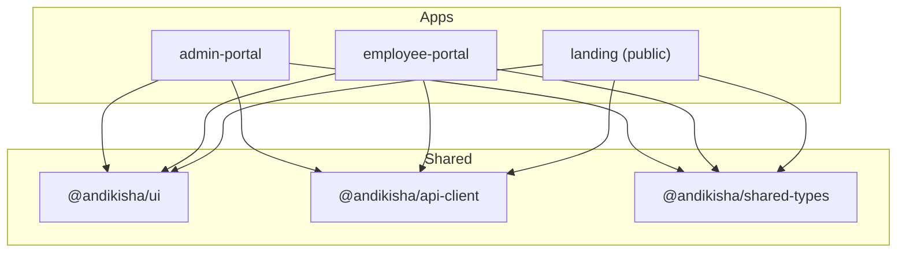

# AndikishaHR Frontend

Enterprise HR and Payroll SaaS frontend for Kenyan and East African SMEs.

This directory contains the **AndikishaHR frontend workspace** — a pnpm monorepo with three
Next.js applications and three shared internal packages.

- **Landing** — public marketing site (blog, pricing, demo request)
- **Admin Portal** — HR manager / admin dashboard
- **Employee Portal** — self-service portal for employees

Built with **TypeScript**, **Next.js 15** (App Router), and **Tailwind CSS**.

---

## 📁 Architecture

```
frontend/
├── landing/              # Marketing site (port 3002)
├── admin-portal/         # Admin dashboard (port 3000)
├── employee-portal/      # Employee self-service (port 3001)
└── packages/
    ├── ui/               # Shared React UI components
    ├── api-client/       # Axios wrapper with auth interceptor
    └── shared-types/     # TypeScript interfaces for backend DTOs
```



---

## 🛠 Tech Stack

| Layer | Technology |
|-------|------------|
| Language | TypeScript 5.7 |
| Framework | Next.js 15 (App Router) |
| React | 19.0.0 |
| Styling | Tailwind CSS (v3 in landing, v4 in portals) |
| Package Manager | pnpm 9.15.0 |
| Node | 20.19.0 (`.nvmrc`) |
| Icons | Lucide React |
| State | Zustand (portals) |
| Data | TanStack React Query, Axios |
| Validation | Zod |
| Forms | Native + Zod |

---

## 🚀 Getting Started

### Prerequisites

- **Node.js** `>= 20.19.0` (use `.nvmrc`):
  ```bash
  nvm use
  ```
- **pnpm** `>= 9.15.0`:
  ```bash
  npm install -g pnpm@9.15.0
  ```

### Install dependencies

```bash
# Run from the project root
pnpm install
```

### Run all apps

```bash
# Landing only  (http://localhost:3002)
pnpm dev:landing

# Admin portal only (http://localhost:3000)
pnpm dev:admin

# Employee portal only (http://localhost:3001)
pnpm dev:employee

# Build everything
pnpm build:all

# Type-check everything
pnpm type-check

# Lint everything
pnpm lint
```

---

## 📦 Apps

### `landing` — Marketing Site

| Key | Value |
|-----|-------|
| Port | `3002` |
| Next.js | `15.5.15` (latest) |
| Tailwind | `v3.4.1` |
| Router | App Router (`app/`) |

**Pages**

| Route | Description |
|---|---|
| `/` | Home — hero, features, pricing, FAQ, CTA |
| `/features` | Full product feature breakdown |
| `/pricing` | Pricing cards + comparison table |
| `/about` | Company story, mission, team, careers |
| `/blog` | Blog listing (MDX) |
| `/blog/[slug]` | Individual blog post |
| `/demo` | Demo request form |
| `/contact` | Contact form + details |
| `/privacy` | Privacy policy |
| `/terms` | Terms of service |
| `/security` | Security and compliance |

**Key Features**

- Custom brand theme with Tailwind config (`tailwind.config.ts`)
- Fonts: **Bricolage Grotesque** (display), **DM Sans** (body), **DM Mono** (numbers)
- Blog powered by `next-mdx-remote` + `gray-matter` + MDX files in `content/blog/`
- API Routes:
  - `POST /api/contact` — contact form with Resend email
  - `POST /api/demo` — demo request form
  - `POST /api/newsletter` — newsletter signup
- SEO/OG meta tags, structured data, favicon, scroll progress bar
- WhatsApp floating CTA, mobile CTA bar, animated sections (`IntersectionObserver`)

**Environment Variables**

```env
# Optional — only needed for actual email sending
RESEND_API_KEY=re_xxxxxxxxxxxx
RESEND_FROM=hello@andikishahr.com
CONTACT_TO=sales@andikishahr.com
NEXT_PUBLIC_GA_ID=G-XXXXXXXXXX
```

---

### `admin-portal` — HR Manager Dashboard

| Key | Value |
|-----|-------|
| Port | `3000` |
| Next.js | `15.1.0` |
| Tailwind | `v4.0.0` |
| Router | App Router (`src/app/`) |

**Current State**

> ⚠️ This app is a **stub** in active development. Only the base layout (`layout.tsx`) and placeholder homepage (`page.tsx`) exist.

**Planned Features**

- Employee CRUD, department management, salary adjustments
- Payroll run initiation, approval workflows, statutory reports
- Analytics dashboards with Recharts (`recharts` already in `package.json`)
- Role-based access (HR Manager, Admin)

**Dependencies**

| Package | Purpose |
|---------|---------|
| `zustand` | Global state |
| `@tanstack/react-query` | Server state management |
| `axios` | HTTP client (via `@andikisha/api-client`) |
| `zod` | Schema validation |
| `date-fns` | Date formatting |
| `recharts` | Charts and analytics |
| `@radix-ui/react-dialog`, `@radix-ui/react-dropdown-menu`, `@radix-ui/react-select`, `@radix-ui/react-tabs` | Headless UI primitives |

---

### `employee-portal` — Self-Service Portal

| Key | Value |
|-----|-------|
| Port | `3001` |
| Next.js | `15.1.0` |
| Tailwind | `v4.0.0` |
| Router | App Router (`src/app/`) |

**Current State**

> ⚠️ This app is a **stub** in active development. Only the base layout (`layout.tsx`) and placeholder homepage (`page.tsx`) exist.

**Planned Features**

- Payslip download / view
- Leave request and balance tracking
- Profile and bank detail updates
- Attendance calendar view

**Dependencies**

| Package | Purpose |
|---------|---------|
| `zustand` | Global state |
| `@tanstack/react-query` | Server state management |
| `axios` | HTTP client (via `@andikisha/api-client`) |
| `zod` | Schema validation |
| `date-fns` | Date formatting |
| `@radix-ui/react-dialog`, `@radix-ui/react-tabs` | Headless UI primitives |

---

## 📦 Shared Packages

All packages live under `frontend/packages/` and are referenced via `workspace:*` in app
`package.json` files.

### `@andikisha/ui`

Shared React UI components and utilities.

**Current exports**

```ts
import { Button } from "@andikisha/ui";
import { cn } from "@andikisha/ui";
```

- `Button` — configurable variant (`primary` | `secondary` | `outline` | `danger` | `ghost`) and size (`sm` | `md` | `lg`)
- `cn(...)` — Tailwind class-merge helper using `clsx` + `tailwind-merge`

**Build**

```bash
pnpm --filter @andikisha/ui type-check
pnpm --filter @andikisha/ui lint
```

---

### `@andikisha/api-client`

Axios-based HTTP client with automatic Bearer token injection.

**Usage**

```ts
import { apiClient, createApiClient } from "@andikisha/api-client";

// Uses NEXT_PUBLIC_API_URL or falls back to localhost:8080
const users = await apiClient.get("/api/v1/employees").then(r => r.data);

// Or create a named client with a custom token getter
const client = createApiClient("https://api.andikishahr.com", () => getTokenFromStore());
```

**Build**

```bash
pnpm --filter @andikisha/api-client type-check
pnpm --filter @andikisha/api-client lint
```

---

### `@andikisha/shared-types`

TypeScript interfaces mapped from the backend DTOs.

**Current types**

```ts
import type {
  Employee,
  EmploymentStatus,
  LoginRequest,
  TokenResponse,
  UserProfile,
  PageResponse,
  ApiError,
  FieldError,
} from "@andikisha/shared-types";
```

These types should be kept in sync with the backend OpenAPI / gRPC contracts.

**Build**

```bash
pnpm --filter @andikisha/shared-types type-check
pnpm --filter @andikisha/shared-types lint
```

---

## 🎨 Brand Style

The **landing** app defines the canonical AndikishaHR brand palette:

| Token | Hex | Usage |
|-------|-----|-------|
| `brand-950` | `#071e13` | Darkest background |
| `brand-900` | `#0b3d2e` | Primary dark green |
| `brand-800` | `#0f5040` | Secondary dark |
| `brand-700` | `#166a50` | Medium green |
| `brand-500` | `#27a870` | Accent / links |
| `brand-100` | `#d1f5e6` | Light tint |
| `brand-50` | `#e8f5f0` | Pale background |
| `amber.DEFAULT` | `#e8a020` | Primary CTA button |
| `amber.dark` | `#c98510` | Hover state |
| `amber.light` | `#fef3dc` | Background tint |

Fonts: `Bricolage Grotesque` display, `DM Sans` body, `DM Mono` numbers/monospace.

> **Note:** The portals currently use pure Tailwind defaults. When they reach production maturity, brand tokens should be extracted into a shared Tailwind preset or CSS variables consumed by all three apps.

---

## 🧪 Testing

> ⚠️ **No source-level tests exist yet.**
> The only test-like files found are inside `node_modules/`.

**Recommended stack to adopt**

| Level | Tool | Scope |
|-------|------|-------|
| Unit / Component | Vitest + React Testing Library | `@andikisha/ui`, forms |
| E2E | Playwright | Full user journeys across all three apps |
| Visual Regression | Chromatic / Percy | UI consistency |

**Example target areas**

- `landing`: contact/demo form submission, MDX blog rendering, navigation responsive states
- `admin-portal`: employee CRUD flows, payroll approval workflow
- `employee-portal`: leave request flow, payslip download

---

## 🚧 Known Issues & TODOs

1. **Tailwind version mismatch**
   - `landing` uses **Tailwind CSS v3** (`tailwind.config.ts` + `@tailwind base/components/utilities`).
   - `admin-portal` and `employee-portal` use **Tailwind CSS v4** (`@import "tailwindcss"`).
   - `@andikisha/ui` does not declare a Tailwind peer dependency, so its utility classes may behave differently across apps.
   - **Recommended fix:** Migrate landing to Tailwind v4, or pin all apps to v3 and add a shared Tailwind preset.

2. **Stub portals**
   - `admin-portal` and `employee-portal` only have `layout.tsx` and `page.tsx`. Development is pending backend API readiness.

3. **Landing has `package-lock.json`**
   - Despite pnpm being the declared manager, the landing app contains a `package-lock.json` (npm lockfile). This should be removed to avoid confusion; pnpm's workspace lock is maintained at the monorepo root.

4. **No shared Tailwind config**
   - Each app re-declares Tailwind theme separately. Extract a `@andikisha/tailwind-config` package (or shared CSS variables) once brand tokens are finalized.

5. **Type drift risk**
   - `@andikisha/shared-types` is manually maintained. Consider generating types from the backend OpenAPI spec (via `openapi-typescript`) to keep them automatically in sync.

---

## 🚢 Deployment

### Landing (Vercel)

A `vercel.json` is present in `landing/`:

```json
{
  "framework": "nextjs",
  "installCommand": "pnpm install --frozen-lockfile",
  "buildCommand": "pnpm build",
  "devCommand": "pnpm dev",
  "outputDirectory": ".next"
}
```

**Deploy**

```bash
cd frontend/landing
vercel --prod
```

### Portals

`admin-portal` and `employee-portal` are configured with `output: "standalone"` in `next.config.ts`, making them suitable for:

- **Docker**: build standalone output, copy `.next/standalone` into a minimal Node.js image
- **Vercel**: deploy as individual Next.js apps
- **Self-hosted**: run `node server.js` from the standalone output

---

## 📜 License

Private — AndikishaHR Limited. All rights reserved.
